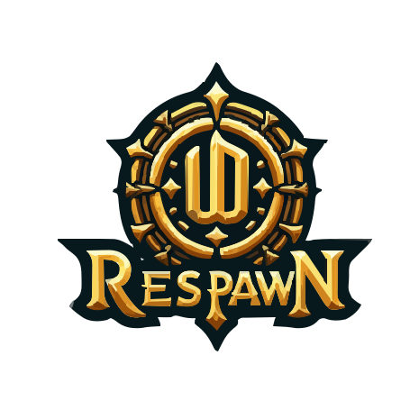

# UORespawn Editor

<p align="center">
  
</p>

<p align="center">
  <strong>A powerful spawn management tool for Ultima Online servers running ServUO or ModernUO (MUO)</strong>
</p>

<p align="center">
  <a href="#features">Features</a> •
  <a href="#download">Download</a> •
  <a href="#installation">Installation</a> •
  <a href="#usage">Usage</a> •
  <a href="#building">Building</a> •
  <a href="#support">Support</a>
</p>

---

## 📌 About

UORespawn is a modern .NET MAUI application that provides a comprehensive visual interface for creating and managing spawn systems in Ultima Online servers running **ServUO** or **ModernUO (MUO)**. It offers four complementary spawn methods to populate your world with creatures and NPCs.

**Version:** 2.0.1.3  
**Platform:** Windows, macOS  
**Framework:** .NET 10 MAUI with Blazor  
**License:** MIT

---

## ✨ Features

### 🗺️ Box Spawn Editor
- Visual map-based spawn box creation
- Draw spawn areas with left-click and drag
- **Edge-pan during draw** — Map auto-pans when the cursor reaches a canvas edge, allowing boxes larger than the viewport
- **OS cursor confined to canvas while drawing (Windows)** — Prevents accidental click-outs mid-draw via Win32 `ClipCursor`
- Pan the map with right-click and drag or WASD/Arrow keys
- Zoom toggle (1x actual size / 2x zoomed / 4x close-up)
- Mini-map with click-to-navigate
- Priority-based spawn layering
- Six frequency tiers (Common, Uncommon, Rare, Water, Weather, Timed)
- **Interactive XML spawner overlay** - hover to highlight, click for tooltip with location and home range
- **Interactive server spawn statistics** - dwell-based tooltips showing player name, location, and total spawn events
- **XML Spawner Management (v2.0.1.0+)**:
  - Right-click to add new XML spawners with HomeRange/MaxCount configuration
  - Press **DEL** while hovering to delete XML spawners
  - Press **ENTER** while hovering to edit XML spawners (v2.0.1.1+)

### 🏰 Region Spawn System
- Spawn creatures by named server regions
- Configure spawns for regions like "Britain", "Dungeon Despise", etc.
- Automatic region boundary detection
- Per-region creature assignments
- **Map index numbers** displayed on regions for quick identification
- Search regions by index number in the list header
- Simplifies large area spawn management

### 🌍 Tile Spawn System
- Tile-based automatic spawning
- Configure spawns for terrain types (grass, forest, water, desert, etc.)
- Six frequency tiers for precise control
- Applies globally to all maps

### ⚙️ Server Integration (v2.0.1.3+)

#### 🖼️ Step 1 — Choose Server Type
- **ServUO or ModernUO (MUO)** — Logo toggle at the top of the Server Integration card
  - All folder path hints update automatically to match your server's layout
  - ServUO: `Scripts/Custom/` + `Data/` | MUO: `Projects/UOContent/Custom/` + `Distribution/Data/`

#### 🔗 Link Local (Recommended)
- **Two-Path Linking** — Separate folder pickers for Custom Scripts and Server Data folders
- **Auto-Install** — Scripts installed to `Custom/UORespawnServer/`; `Data/UORespawn/` created automatically
- **Auto-Update** — Editor detects version mismatches and prompts before updating scripts
- **Broken Link Detection** — Amber button appears when stored paths can't be found; auto-repair walks parent directories to relocate the server

#### 🌐 FTP Remote Server
- **Two Remote Paths** — Remote Custom Scripts Path + Remote Data Exchange Path (both react to server type)
- **Push to Server** — Upload spawn data (.bin files) to remote server's `UORespawn/INPUT/` folder
- **Pull from Server** — Download reference data (.txt files) from remote server
- **Secure Credentials** — FTP credentials stored in user-controlled folders, not in app
- **Cancellation Support** — Cancel long-running transfers at any time
- **Progress Tracking** — Real-time file-by-file transfer status

#### 📦 Manual Export/Import
- Export server scripts and data packs as ZIP files
- Import via FTP client or file manager
- Full control for advanced users

### 🛡️ Security Features (v2.0.0.9+)
- **No Password Required** - App accounts are just friendly names pointing to folders
- **User-Controlled Storage** - All credentials stored in YOUR folder, not in the app
- **Zero Cloud Dependency** - No external servers, no account databases
- **Delete Folder = Data Gone** - Full control over your sensitive data

### 🎮 In-Game Editing (v2.0.1.2+)
- Open the **Control Panel** with `[UORespawn` (Administrator access required)
- Click **Edit Spawn** to get a target cursor
- **Target the ground, a shop sign, or a beehive** — the system opens all relevant spawn editors for that location:
  - **Ground / Item** → Spawn Edit Gump(s) for any Box, Region, or Tile spawn at that point
  - **Shop Sign** → Vendor Edit Gump for that sign location
  - **Beehive** → Vendor Edit Gump for that hive
- Add, remove, or edit creatures directly in the gump — changes take effect on the next spawn cycle

### 🎨 Additional Features
- **Professional Admin GUI** - In-game control panel with `[UORespawn`
- **Intelligent Recycling** - Up to 60% mob reuse for optimal performance
- **Real-time Metrics** - Monitor spawn performance with `[SpawnStats`
- **Debug Mode** - Use `[ShowRespawn` to see all spawnable creatures at your location
- **Spawn Packs** - Three-category system (Approved, Created, Imported) for managing spawn configurations
- Pack Dashboard with detailed statistics (entry counts + location counts)
- **Intelligent pack sync** - Only syncs changes when actual edits are made
- **Bestiary Favorites** - Star creatures for quick access in spawn modals
- **Vendor Favorites** - Star vendors for quick access in vendor spawn editor
- **Light/Dark Theme Support** - Full theming with automatic contrast adjustments (v2.0.1.0+)
- Custom map image replacement (including custom maps beyond default 6)
- Bestiary management (600+ creatures)

### 🏪 Vendor Spawn Editor
- Configure vendors at shop signs and hive locations
- Browse by sign type (Bakery, Blacksmith, Tailor, Mage, Healer, etc.)
- Per-location vendor assignment with map markers
- **Bulk "Add to All"** - Add vendors to all locations of a sign type at once
- Green glow markers for configured locations
- Duplicates allowed (e.g., 3 Beekeepers at one hive)
- Hive/Beehive support for Beekeeper spawning
- Special NPCs (TownNPC, AmbushNPC, Effect NPCs)
- Cross-platform (Windows and macOS)
- Info icons for contextual help throughout

---

## 📥 Download

### Latest Release
Download the latest version from the [Releases](https://github.com/Kita72/UORespawnProject/releases) page.

### Platform Support
- **Windows 10/11** - x64
- **macOS** - Apple Silicon & Intel

---

## 🚀 Installation

### Windows
1. Download the Windows release (.zip)
2. Extract to your preferred location
3. Run `UORespawnApp.exe`
4. (Optional) Link your server folder in Settings for auto-sync

### macOS
1. Download the macOS release (.app)
2. Move to Applications folder
3. Run the application
4. (Optional) Link your server folder in Settings for auto-sync

### First Run

1. The app will create a `Data` folder for spawn files
2. **DefaultPack** automatically loads on first launch
3. Map images (Map0-Map5.bmp) should be in the `Data/MAPS` folder
4. Configure your spawn settings in the Settings page
5. Start creating spawns or import a spawn pack!

---

## 📖 Usage

### Quick Start

1. **Select a Map** - Use the dropdown in the left navigation
2. **Choose a Spawn Type:**
   - **Box Spawn** - Draw boxes directly on the map
   - **Region Spawn** - Assign creatures to named regions
   - **Tile Spawn** - Configure tile-based automatic spawns
3. **Add Creatures** - Select from the bestiary
4. **Configure Settings** - Adjust spawn parameters
5. **Auto-Sync** - Files automatically sync to your linked server folder

### Box Spawn Controls

- **Left-Drag:** Draw spawn box
- **Edge-Pan:** Move near a canvas edge while drawing to auto-pan the map
- **Cursor Lock (Windows):** Cursor is confined to the canvas during draw — no accidental click-outs
- **Right-Drag:** Pan the map
- **WASD/Arrow Keys:** Pan the map (supports diagonal movement)
- **Zoom Button:** Toggle 1x / 2x / 4x zoom
- **Mini-Map Click:** Jump to location
- **XML Toggle:** Show/hide XML spawners (hover to highlight, click for tooltip)
- **Spawns Toggle:** Show/hide server spawn stats (hover for player info)

### Special NPCs

Add these predefined NPCs from the bestiary:
- `TownNPC`, `WorldNPC`, `AmbushNPC`
- Effect NPCs: `FireEffectNPC`, `PoisonEffectNPC`, `GlowEffectNPC`, etc.

### Binary Files Generated

- `UOR_SpawnSettings.csv` - System configuration
- `UOR_BoxSpawn.bin` - Map spawn boxes
- `UOR_TileSpawn.bin` - Tile spawns
- `UOR_RegionSpawn.bin` - Named region spawns
- `UOR_VendorSpawn.bin` - Vendor spawn assignments

---

## 🔨 Building from Source

### Prerequisites

- [.NET 10 SDK](https://dotnet.microsoft.com/download/dotnet/10.0)
- [Visual Studio 2026](https://visualstudio.microsoft.com/) or [Visual Studio 2022](https://visualstudio.microsoft.com/) (v17.14 or later)
- Workloads:
  - .NET Multi-platform App UI development
  - ASP.NET and web development

### Clone and Build

```bash
git clone https://github.com/Kita72/UORespawnProject.git
cd UORespawnProject
dotnet restore
dotnet build
```

### Run

```bash
cd UORespawnApp
dotnet run
```

### Platform-Specific Builds

**Windows (quick � double-click):**
```
Publish.cmd
```
Double-click `Publish.cmd` at the solution root. A PowerShell window opens, builds a self-contained Windows x64 package, and saves the release ZIP to `Releases/` automatically � version name included, no manual edits needed.

**Windows (manual):**
```bash
dotnet publish -f net10.0-windows10.0.19041.0 -c Release
```

**macOS:**
```bash
dotnet publish -f net10.0-maccatalyst -c Release
```

---

## 📁 Project Structure

```
UORespawnProject/
├── UORespawnApp/              # Main MAUI application
│   ├── Components/            # Blazor components
│   │   ├── Layout/           # Navigation and layout
│   │   └── Controls/         # Reusable components
│   │       ├── BoxSpawnComponent.razor
│   │       ├── RegionSpawnComponent.razor
│   │       ├── TileSpawnComponent.razor
│   │       ├── SpawnPacksComponent.razor
│   │       ├── SettingsComponent.razor
│   │       └── InstructionsComponent.razor
│   ├── Scripts/              # C# utility scripts
│   ├── UORespawnServer/      # Server-side scripts for ServUO
│   ├── wwwroot/              # Web assets (JS, CSS)
│   └── Resources/            # App resources
├── README.md
├── LICENSE
└── UORespawnProject.sln
```

---

## 💬 Support

### Need Help?

- **Wilson (Creator):** [ServUO Profile](https://www.servuo.com/members/wilson.12169/)
- **ServUO Community:** [www.servuo.com](https://www.servuo.com)
- **Issues:** [GitHub Issues](https://github.com/Kita72/UORespawnProject/issues)

### Contributing

Contributions are welcome! Please feel free to submit a Pull Request.

1. Fork the repository
2. Create your feature branch (`git checkout -b feature/AmazingFeature`)
3. Commit your changes (`git commit -m 'Add some AmazingFeature'`)
4. Push to the branch (`git push origin feature/AmazingFeature`)
5. Open a Pull Request

---

## 📜 License

This project is licensed under the MIT License - see the [LICENSE](LICENSE) file for details.

---

## 🙏 Acknowledgments

- ServUO team for the amazing server platform
- ModernUO team for the modern UO server platform
- Ultima Online community for continued support
- All contributors and testers

---

<p align="center">
  Made with ❤️ for the ServUO and ModernUO communities
</p>

<p align="center">
  <a href="#top">Back to Top</a>
</p>


